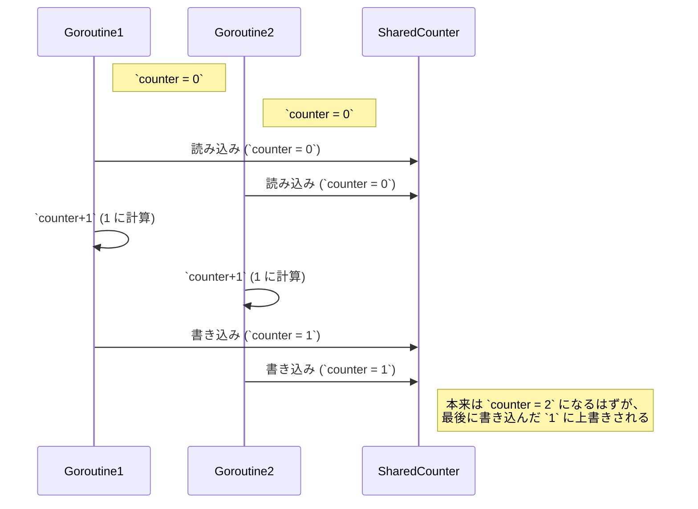

# Go言語 文法


## Go固有の特徴

- 関数名や変数名を大文字にするとpublicになる
- インデントはハードタブ文字と決まっている(タブ論争が起きない)
- フォーマッターもパッケージ内臓を利用する
- 例外が存在しない。エラーオブジェクトを返す


## 利用シーン

- アプリのバックエンド
- コマンドアプリ


## 特徴

- マルチプラットフォーム
- goroutineで軽量スレッドを利用でき、並行プログラミングが書きやすい
- シングルバイナリ
- エコシステムの充実
- 言語仕様がシンプルなので、能力差があまり現れず、開発の引き継ぎやレビューがしやすい


## 言語仕様
- GCあり
- 静的型付け
- ポインタを扱える(逆にこれはnil exceptionが起こりがちな問題もある)
- 行末に;は不要
- 使用されない変数があるとエラーになる


## 型

論理値型

|型|値| note |
|:----|:----|:-----|
|bool|true, false||

数値型

| 型      |値| note |
|:-------|:----|:-----|
| int8   |-128 ～ 127||
 | int16  |-32768 ～ 32767||
 | int32  |-2147483648 ～ 2147483647||
 | int64  |-9223372036854775808 ～ 9223372036854775807||
 | int    |32bit または 64bit (環境依存)||
 | unit8  |0 ～ 255||
 | unit16 |0 ～ 65535||
 | unit32 |0 ～ 4294967295||
 | unit64 |0 ～ 18446744073709551615||
 | unit   |32bit または 64bit|環境依存|

浮動小数点型

|型|値| note |
|:----|:----|:-----|
|float32|32ビット||
|float64|64ビット||

文字列型

|型|値| note |
|:----|:----|:-----|
|string|文字列||

## 変数宣言

Goの慣習
- 変数名はPascal Case
- できるだけ変数名は短く(indexだったらiとか、RegisterAccountUsecaseだったらrauとか、)

```go
// basicな書き方
var job string = "programmer"

// ↑の省略形
job string = "doctor"

// 再代入禁止(コンパイルエラーになる)
job string := "student"

// 定数を宣言
const version = 1

// 列挙
type Month int
const (
	January Manth = iota
	February
	March
    April
)
fmt.Println(February) // 2
```

## 関数

Goの関数は2つ以上の変数も返せる(Elixirのタプルみたいな感じ)

```go
func SearchUser(ctx context.Context, name string) (*model.Account, error) {
	logger := zap.WithTraxe(ctx, zap.NewLogger())
	account, err := searchUserByName(name)
	if err != nil {
		zap.
		return nil, app.NotFoundError("ユーザが見つかりません")
    }
    return account, nil	
}
```

## ポインタ

ポインタは変数名の前に*をつける

```go
list := []*model.Accont{}
```

またポインタを参照するのではなく、値を取得したい場合(これをよく実体を参照する、などと言われている)

```go
package main
import "fmt"

type Person struct {
    name    string
    age     int
    address string
}

func main() {
    p := Person{
        name: "Jotaro",
        age:  18,
    }

    // ポインタによる参照
    age := &p.age
    name := p.name
	
    // 実体で取り出し
    fmt.Printf("age is %d\n", *age)
    fmt.Printf("name is %s\n", name)
}
```

## if

```go
if job == "programmer" {
	fmt.Println("your job is %s", job)
}
```

## 比較

```go
a == b 
a != b 
a > b  
a >= b 
a < b
a <= b 
a && b 
a || b
!a
```


## 配列

長さが決まった配列(長さ以上の要素を詰め込もうとするとパニックが発生する)

```go
// 宣言するだけだとaはnilの状態
var a [5]string

a[6] = "yours" // panic
```

長さが任意の配列

```go
// 初期値の書き方
nameList = []string{"john", "alice", "jane"}

// number array
scores = []int32{10, 32, 49, 44, 95}

// 配列に要素を追加するには
scores = append(scores, 38, 80, 70)
```

配列の削除方法(いくつかやり方があるが、これが一番実行速度が速い)
scores = append(scores[:50], scores[:51]...) // 先頭から50文字目を削除

(後日追記)↑が速いと思っていたらこっちの方がいいらしい。アロケーションが発生しない。

```go
scores = scores[:50+copy(scores[50:], scores[51:])]
```

## for

forはcontinueで次のループに行くこともできるし、breakでforを一気に抜けることも可能

C形式

```go
for i:=0; i<10; i++ {
	// 処理を記述
}
```

スライス形式

```go
// i is number
for i, name := range nameList {
    fmt.Println("member is %s. No.%d", name, i)
}
```

## マップ

```go
// 配送料の原価を取り出すマップ
deliveryPriceMap := make(map[string]int)
deliveryPriceMap["delivery_small"] = 1029
deliveryPriceMap["delivery_big"] = 2580
fmt.Println(deliveryPriceMap["delivery_big"])
```

## 構造体

type 構造体名の後ろにstructキーワードをつける

```go
type Person struct {
     name: string,
	 age: uint8,
     address: string
}
```

## reciever

構造体にメソッドを追加することができる。

funcキーワードの後ろに(変数名 構造体)をつけることで構造体に関数を付与することができる。

Javaでいうclassみたいなもの(全然別物だけど💦)

```go
func (p Person) updateAddress(s string) Person {
	p.address = s
	return p
}
```

## コンストラクタ

Goには構造体にコンストラクタは存在しない。が、慣習的にNewを接頭辞にして初期化することがよくある(正直、言語仕様にしてしまえと思いますが)

```go
type Person struct {
    name: string,
    age: uint8,
    address: string
}

// この時ポインターで返すのがミソ
func NewPerson(name string, age string, address string) *Person {
	return &Person {
		name: name,
		age: age,
        address: address,
    }
}

```

## 関数

```go
func getPerson(name string) (Person) {
	person := Person{
		name: name,
		age: 10,
		address: string
    }
	
	return person
}
```

## インターフェース

interfaceキーワードはどんな型でも入れられる型(1.18以降はanyも代用できる)。値を取り出すときは型アサーションを行う必要がある。

```go
var a interface{}

a = 1
fmt.Println("a is number: %d", a.(int))
```

interfaceはメソッドを持つ型をインターフェースを作ることも可能

```go
type Shopping interface {
	Buy() error
    ReturnItem(id int) error
}
```

何に役に立つのか？たとえば、買い物でクレジットで購入する場合でも現金で購入する場合でも同じ買うことに変わりない。

クレジットで買った場合の処理の仕方と、キャッシュで購入した場合の処理の仕方とをわけて実装できる

```go
package main

import "fmt"

type Shopping interface {
    Buy() error
    ReturnItem(id int) error
}

func DoBuy(s Shopping) error {
    return s.Buy()
}

type MethodByCredit struct{}

func (m MethodByCredit) Buy() error {
    fmt.Println("クレジットで購入")
    return nil
}

func (m MethodByCredit) ReturnItem(id int) error {
    fmt.Printf("クレジットで商品 %d を返品\n", id)
    return nil
}

type MethodByCache struct{}

func (m MethodByCache) Buy() error {
    fmt.Println("現金で購入")
    return nil
}

func (m MethodByCache) ReturnItem(id int) error {
    fmt.Printf("現金で商品 %d を返品\n", id)
    return nil
}

func main() {
    // クレジット支払い
    credit := MethodByCredit{}
    DoBuy(&credit)
    
    // 現金支払い
    cache := MethodByCache{}
    DoBuy(&cache)
}
```

## deferとパニック

deferを使うと関数終了時に非同期で処理を行ってくれる。ファイルのクローズ処理やreaderのクローズなど解放処理を書くことが多い。

```go
package main

import "fmt"

func safeFunction() {
	defer func() {
		if r := recover(); r != nil {
			fmt.Println("⚠️ パニック発生！でも recover で回復:", r)
		}
	}()

	fmt.Println("✅ 正常な処理中...")
	panic("💥 ここでパニック！") // 意図的にパニックを発生
	//fmt.Println("この行は実行されない")
}

func main() {
	fmt.Println("🚀 プログラム開始")
	safeFunction()
	fmt.Println("✨ プログラム継続") // recover によってパニックが回復される
}
```

基礎編はここまで。

# 並行処理

## goroutine(ゴルーチン)

goroutineとは
- 軽量スレッド(簡単に数千ものgoroutineが起動できる)
- 並行処理で動く(ノンブロッキングな処理でいくつもの処理を同時に実行できる)

実際にはかなり短い時間で処理を切り替えながら実行しているのであたかも並行処理で動いているかのように見えている。

goroutineを起動させるには関数名の前にgoをつけるだけ。

```go
package main

import (
 "fmt"
 "time"
)

func count(name string) {
 for i := 1; i <= 5; i++ {
  fmt.Println(name, i)
  time.Sleep(time.Millisecond * 500) // 0.5秒待つ
 }
}

func main() {
 go count("🐱 Cat") // goroutine 1
 go count("🐶 Dog") // goroutine 2
 count("🐵 Monkey") // メイン関数の通常処理（同期）

 // goroutine が終わるまで待つ
 time.Sleep(time.Second * 3)
}
```

## Race Condition

いわゆる、競合状態のこと。

実際に起こしてみる

```go
package main

import (
	"fmt"
	"runtime"
	"time"
)

var counter int = 0

func increment() {
	for i := 0; i < 10000; i++ {
		counter++ // 🔥 ここでレースコンディション発生
	}
}

func main() {
	runtime.GOMAXPROCS(16) // CPU コア数を増やして並行性を上げる

	go increment()
	go increment()

	time.Sleep(time.Second)
	fmt.Println("Final Counter:", counter)
}

```

```go
$ go run main.go                                                                                                                                                                                   15:28:44
Final Counter: 2000
$ go run main.go                                                                                                                                                                                   15:28:49
Final Counter: 1923
$ go run main.go                                                                                                                                                                                   15:28:53
Final Counter: 2000
$ go run main.go                                                                                                                                                                                   15:28:53
Final Counter: 1000
$ go run main.go                                                                                                                                                                                   15:28:53
Final Counter: 2000
$ go run main.go                                                                                                                                                                                   15:28:53
Final Counter: 1339
```

なぜレースコンディションが起きるのか。

それは、複数のgoroutineが同じ共有データに同時に更新すると予期しない動作が発生する可能性がある。

ランタイムスケジューラがどのgoroutineがいつ起動するかを決めており、呼び出し元とgoroutineとの間でデータ競合が起きてしまう。

結果として、片方の更新が上書きされ、意図しない値が格納されることがあります。

図で書くと。



これを対策するにはいくつかの方法がある。

|方法|説明|メリット|デメリット|
|:---|:---|:---|:---|
|sync.WaitGroup|goroutine の終了を待つ|main() 終了を防げる|goroutine の管理が必要 |
|sync/atomic|ロックなしで競合を防ぐ|Mutex より速いことがある|限られた操作しかできない|
|sync.Mutex|ロックで排他制御|安全に共有データを更新|ロックが増えると遅くなる|

WaitGroupの例(実際にはMutexも組み合わせて使っている)

https://codesandbox.io/p/devbox/resukondeisiyonnojie-jue-waitgroupwoshi-u-8kjlql

atomicの例

https://codesandbox.io/p/devbox/resukondeisiyonnojie-jue-atomicwoshi-u-5c33yx

Mutexの例

https://codesandbox.io/p/devbox/resukondeisiyonnojie-jue-mutexwoshi-u-llngnc

レースコンディションを検出する方法もある。

Goにはrace condition detectorが付属されていて、コンパイル時に-raceをつけることでrace conditionを防ぐことができる。

## channel(チャネル)

goroutine間でデータをやり取りするための仕組み。

並行処理で安全にデータのやり取りができる。

```go
package main

import (
 "fmt"
 "time"
)

func main() {
 ch := make(chan int)

 go func() {
  fmt.Println("データを送信します...")
  time.Sleep(2 * time.Second)
  // ゴルーチンでデータを送信
  ch <- 496
 }()

 go func() {
  fmt.Println("データを送信します...")
  time.Sleep(2 * time.Second)
  // ゴルーチンでデータを送信
  ch <- 1024
 }()

 go func() {
  fmt.Println("データを送信します...")
  time.Sleep(2 * time.Second)
  // ゴルーチンでデータを送信
  ch <- 64
 }()

 fmt.Println("データを待っています...")
 value := <-ch // チャネルからデータを受信（ブロッキング操作）
 fmt.Println("受信したデータ:", value) // 496
 value = <-ch // チャネルからデータを受信（ブロッキング操作）
 fmt.Println("受信したデータ:", value) // 496
 value = <-ch // チャネルからデータを受信（ブロッキング操作）
 fmt.Println("受信したデータ:", value) // 496
}
```

selectを使った方法

```go
package main

import (
	"fmt"
	"time"
)

func process(ch chan string) {
	// 重い処理をシミュレート
	time.Sleep(2 * time.Second)
	ch <- "処理完了"
}

func main() {
	ch := make(chan string)
	
	go process(ch)
	
	// selectを使ったタイムアウト処理
	select {
	case result := <-ch:
		fmt.Println("結果:", result)
	case <-time.After(1 * time.Second):
		fmt.Println("タイムアウト: 処理に時間がかかりすぎています")
	}
}
```

goroutineとchannelを使ったパターン

```go
package main

import (
 "encoding/csv"
 "fmt"
 "io/ioutil"
 "log"
 "net/http"
 "strings"
 "sync"
)

func getFile(url string) []byte {
 resp, err := http.Get(url)
 defer resp.Body.Close()
 if err != nil {
  log.Println("fail to get file. url:%s, err: %v", url, err)
  return nil
 }
 body, err := ioutil.ReadAll(resp.Body)
 if err != nil {
  log.Println("fail to read content file. err: %v", err)
  return nil
 }
 return body
}
func download(wg *sync.WaitGroup, urls []string, ch chan []byte) {
 defer wg.Done()
 defer close(ch)
 for _, u := range urls {
  body := getFile(u)
  ch <- body
 }
}

func main() {
 // run csv server
 server()
 urls := []string{
  "http://localhost:8080/csv/users",
  "http://localhost:8080/csv/users",
  "http://localhost:8080/csv/users",
 }
 ch := make(chan []byte)
 var wg sync.WaitGroup
 wg.Add(1)
 go download(&wg, urls, ch)
 for b := range ch {
  r := csv.NewReader(strings.NewReader(string(b)))
  for {
   record, err := r.Read()
   if err != nil {
    log.Fatal("cause error csv reader. err: %v", err)
    break
   }
   fmt.Println(record)
  }
 }
 wg.Wait()
}
```
